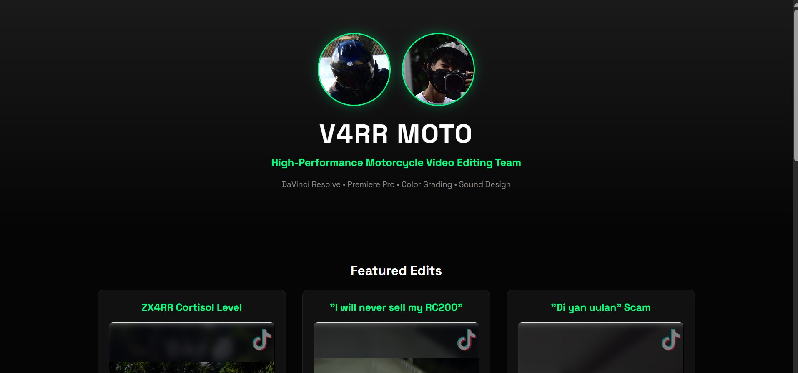
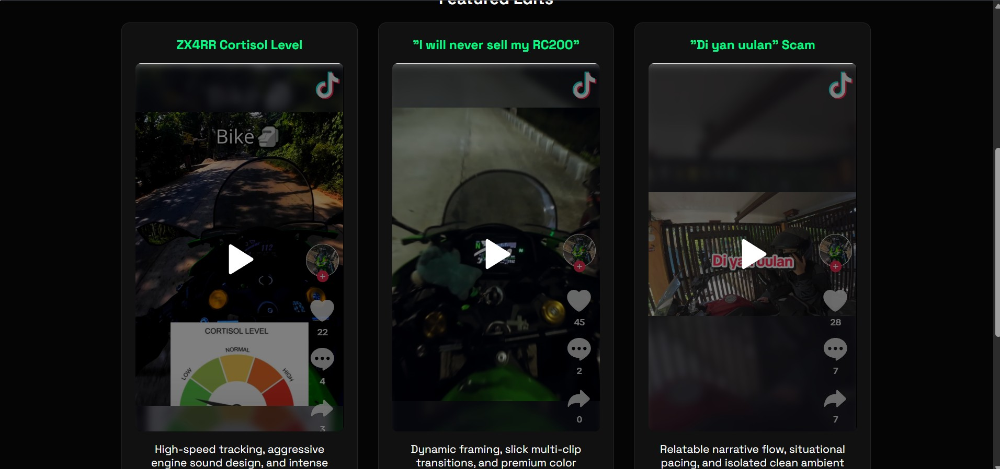
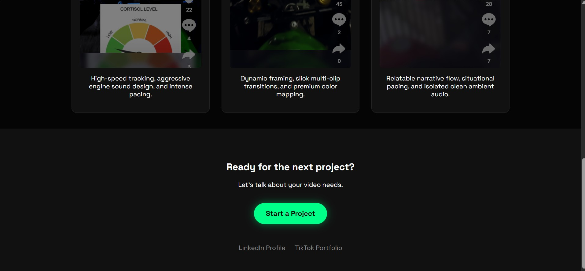
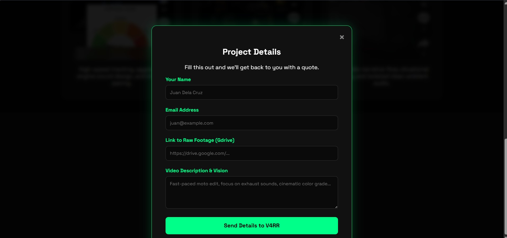

# V4RR MOTO Portfolio

## Project Information

### Subject
 System Integration Architecture

### Academic Year
 2025 - 2026

### Members
* Vincent Mago
* Gerro Orbiso

### Instructor
Ma'am Divine Caabay

## Project Description
 V4RR Moto is a portfolio website that can make potential clients easier to contact us whenever they have a project 
 for us to edit, for we are proficient in video editing.

## Features
* Tiktok integration
* Use of Formspree for filling up details and send to personal email

## Technologies Used
* HTML5
* Formspree
* CSS3
* JavaScript

### Installation Guide
- Clone the repository
 git clone https://github.com/VincentMago/v4rr.github.io.git

- Press go live on vscode

### Video Demo
 https://drive.google.com/drive/folders/1IJsKiWYRfQxNXkULk-ISeJQ7EqpwKEhQ?usp=sharing

## Screenshots

## Future Improvements
- All videos should be able to run
- QR payment for formspree

